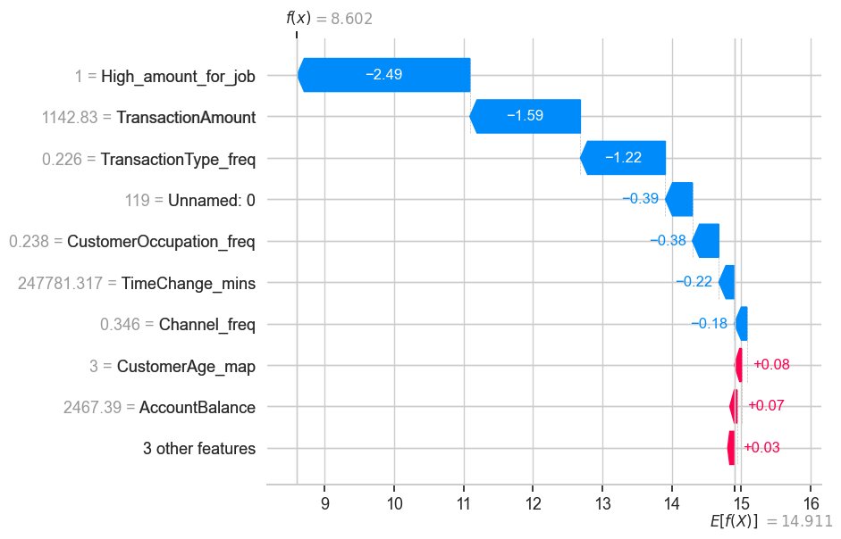

# Banking Fraud Detection
## Overview 
In this project I implemented  an unsupervised machine learaning pipeline that identifies fraudulent or suspicious banking transactions. By shifting shifting a range 0f 0.01% - 0.06% contamination threshold to a statistically optimised 1%(26 high-priority cases), the model minimizes false positives and provides actionable leads for fraud investigations.

## Project Objectives 
Identifying sophisticated Fraud: Identifying non-obvious patterns like account draining and high-velocity transactions that might be a result of bolt-like behaviour.

Temporal Risk Auditing: I analysed those transactions that occur less than 5 minutes that might be automated bot scripts rather than legitimate human transaction.

Precision Optimization: I utilized Isoration Forest and Randomized search to distinguish 26 anomalous transactions that are statistically significant. 

##Data Dictionary 
| Feature | Description | Importance |
| :--- | :--- | :--- |
| **TransactionAmount** | Raw transfer value of transfer/withdrawal. | **High** |
| **Debit_Balance_ratio** | Percentage of total balance spent in one go | **Critical** |
| **Load_and_Go** | A bigger debit transaction that follows a credit transaction that is greater than 90 percentile | **Critical** |
| **Transaction Velocity** | Measures high speed transactions that occur within 30minutes | **Medium** |
| **TimeChange_Mins** | Time elapsed since the previous transaction | Medium |
| **Channel** | Medium used (ATM, Online Branch) | Low |

## Technical Methodology 
1. ###Explanatory Data Analysis(EDA)
Our EDa revealed an 

2. ### Feature Engineering 
! moved beyond raw data by creating 'behavioural signature':
#### Wipeout Detection: Debit_balance_ratio i.e TransactionAmount/AccountBalance.
#### Frequency Encoding: I converted categorical features(Location, Channels) into frequency weights to identify rare event triggers.

3. ### Machine Learning (Isolation Forest)
Optimization: Hyperparameter tuning the model thus getting best parameters that lead to high precision i.e 26 anomalies.

### Model Predictions
These were the anomalies that our model predicted reprsented by a scatterplot, Heatmap for correlation of features and a boxen plot to show anomalous transactions have a high Debit_balance_ratio close to 1.

## Model Explanability and Interpretability 
I Utilize shapley addictive explanations (SHAP) to understand why a transaction is an anomaly.It ranks features that have the most significant impact on model decision across all 2,512 transactions:
Insights: Debit_balance_ratio, Load_to_go, AccountBalance, Transaction velocity(30mins), High_amount_for_job and transaction amount were the primary drivers for identifying anomalies. 

## Local Interpretability(Shap waterfall plot)
For each of the 26 anomalous transactions, 1 generate a waterfall plot that shows the specific push and pull of features for a single transaction.

Positive SHAP values(Red):  These are features that pull the transaction away from  being an anomaly.

Negative SHAP values(Blue): These are features that push the transaction to being an anomaly. The more negative a feature is the more power it has to push a transaction to be anomaly.

